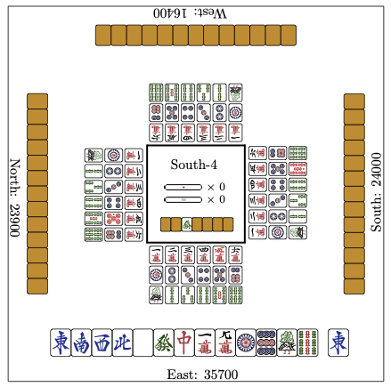
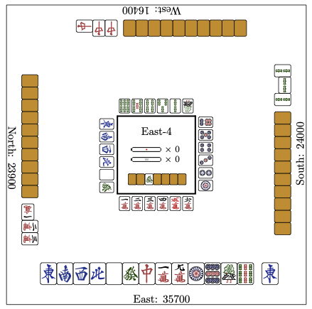

# tikz-riichi-3D

A LaTeX package for generating TikZ figures of Riichi Mahjong hands and discards, intended for creating **3D WWYD (What Would You Discard)** images. While standard WWYD images show only the tiles in your hand, 3D WWYD images include additional context such as the discards of other players, giving a fuller picture of the board state.

This package is derived from [tikz-riichi](https://github.com/riichi/tikz-riichi) by Iipin. The original `mahjong-hand.sty` provides the `\DrawHand` command; this derivative, `mahjong-hand-3D.sty`, adds the `\DrawDiscard` command for rendering discard rows with visible separation between tiles.

## Usage

Two commands are provided:

- `\DrawHand{description}{height}` — draws tiles, suitable for hands.
- `\DrawDiscard{description}{height}` — draws tiles with a small gap (1pt) between each tile, suitable for discard pools.

In both commands, `height` is the target height of the resulting TikZ figure and `description` is the hand description in the following format:

- Any of the `mpsz` changes the current tile suite,
- Any of the `0123456789` (for `mps`), `1234567` (for `z`) or `?` draws a tile. If a `*` follows, the tile is drawn rotated. `0` means red five and `?` means tile back,
- `~` makes space of length equal to 0.5 of tile's width.

Putting a number before the first suite is specified, or including any other characters in the description, results in undefined behavior.

## Examples

A basic 3D WWYD layout combining a hand and multiple discard rows:

A more complex example with rotated tiles indicating tsumogiri or riichi declarations:

## Attribution

This package is a derivative of [tikz-riichi](https://github.com/riichi/tikz-riichi) by Iipin. The following modifications were made:

- Added the `\DrawDiscard` command, which renders tiles with 0.5pt spacing.
- Changed the color of the back of tiles.
- Redefined the internal drawing primitives (`\@DrawNormalTile`, `\@DrawNormalBack`, `\@DrawRotatedTile`, `\@DrawRotatedBack`) to support conditional spacing via a boolean flag.
- Renamed the package to `mahjong-hand-3D` to distinguish it from the original.

Tile images are created by [FluffyStuff](https://github.com/FluffyStuff/riichi-mahjong-tiles) and are in the [public domain](https://github.com/FluffyStuff/riichi-mahjong-tiles/blob/master/LICENSE.md).
